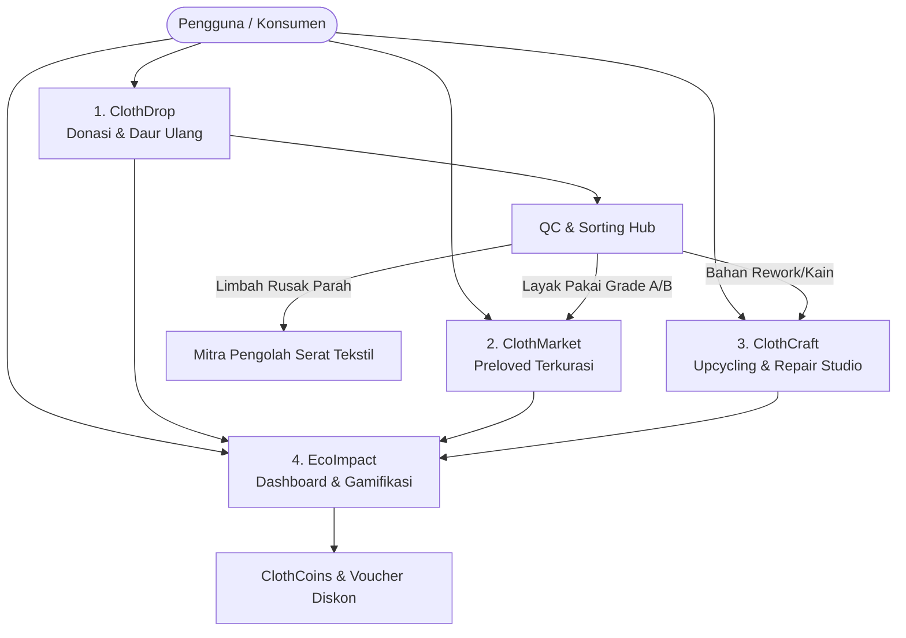
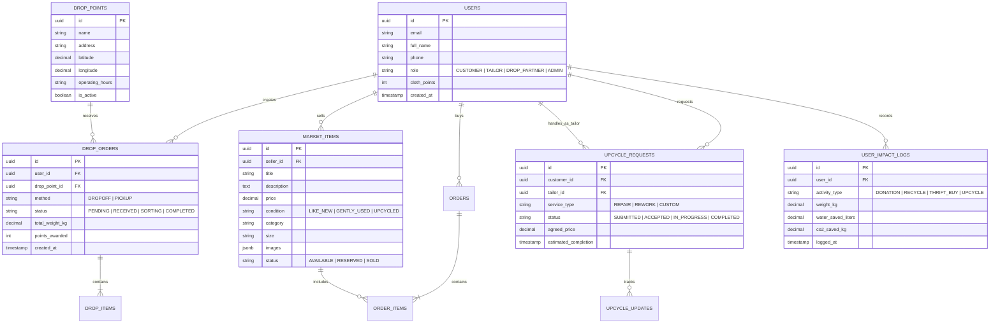
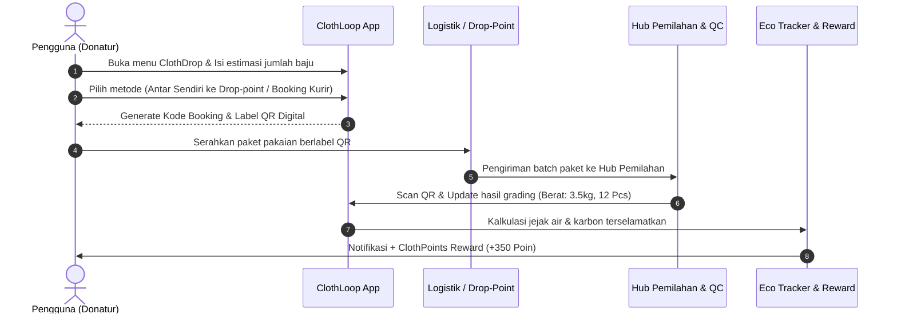
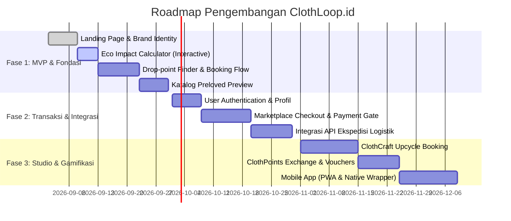

# 🌿 ClothLoop.id — System & Product Design Specification
> **Dokumen Desain Teknis, Arsitektur Sistem, dan UI/UX Design System**  
> *Platform Ekonomi Sirkular Fashion & Daur Ulang Tekstil Berkelanjutan Indonesia*

---

## 1. 📌 Ringkasan Eksekutif & Visi Produk

### 1.1 Latar Belakang
Industri fashion menghasilkan jutaan ton limbah tekstil setiap tahunnya yang berakhir di Tempat Pembuangan Akhir (TPA) tanpa proses dekomposisi yang tepat. Di Indonesia, kesadaran masyarakat terhadap *sustainable fashion* dan *circular economy* mulai meningkat pesat (khususnya Gen-Z dan Milenial), namun infrastruktur digital untuk mengelola pakaian bekas (donasi, daur ulang, perbaikan/upcycling, dan jual-beli preloved terkurasi) masih terfragmentasi.

### 1.2 Visi & Misi
- **Visi:** Menjadi ekosistem digital ekonomi sirkular fashion nomor satu di Indonesia yang menekan angka limbah tekstil menuju *Zero Waste to Landfill*.
- **Misi:**
  1. Memudahkan masyarakat mendistribusikan pakaian tak terpakai melalui sistem **ClothDrop** (Drop-point & Pickup).
  2. Membangun pasar preloved terkurasi dan aman (**ClothMarket**).
  3. Menghubungkan konsumen dengan penjahit & artisan upcycling lokal (**ClothCraft**).
  4. Memberikan transparansi dampak lingkungan (**Eco Impact Tracker**) yang dapat dikonversi menjadi reward nyata.

---

## 2. 👥 Persona Pengguna (User Personas)

| Persona | Peran | Kebutuhan Utama | Pain Points |
| :--- | :--- | :--- | :--- |
| **Eco-Conscious Citizen (Donatur / Recycler)** | Konsumen yang ingin merapikan lemari (*decluttering*) secara bertanggung jawab. | Akses drop point terdekat, layanan jemput pakaian, tracking status pakaian yang disalurkan. | Bingung mau buang pakaian rusak/bekas ke mana tanpa mencemari lingkungan. |
| **Thrift Hunter / Conscious Shopper** | Pembeli pakaian preloved/upcycled berkualitas dengan harga terjangkau. | Katalog terkurasi, verifikasi kondisi pakaian asli, transaksi aman (escrow), pengiriman mudah. | Takut tertipu kondisi barang, ukuran tidak pas, atau seller tidak terpercaya. |
| **Upcycling Artisan & Tailor Partner** | Penjahit & desainer daur ulang pakaian lokal. | Akses ke pasokan bahan baku kain/pakaian bekas, pesanan kustom upcycling/repair. | Sulit menjangkau pasar yang mau membayar jasa rework/upcycling bernilai tinggi. |
| **Drop-Point Partner & Waste Aggregator** | Mitra logistik, bank sampah, atau toko ritel mitra titik kumpul. | Sistem pencatatan batch pakaian masuk, scan barcode/QR, manajemen timbangan (kg). | Pencatatan manual rawan selisih dan pelaporan ke pusat lambat. |
| **ClothLoop Admin & Quality Control** | Tim internal ClothLoop. | Manajemen grading kondisi pakaian, monitoring transaksi, validasi mitra, analisis data dampak. | Kompleksitas logistik dan kategorisasi material tekstil. |

---

## 3. 🧩 Modul & Fitur Utama (Core Capabilities)



### 3.1 📦 ClothDrop (Donation & Recycling Booking)
- **Drop-Point Finder:** Peta interaktif berbasis lokasi (Map/GPS) untuk menemukan titik kumpul ClothLoop terdekat (partner coffee shop, mall, bank sampah).
- **Courier Pickup Booking:** Jadwal penjemputan paket pakaian langsung dari rumah pengguna (integrasi API ekspedisi).
- **Digital Bag Label / QR Code:** Pengguna mendapatkan QR tag digital untuk ditempelkan pada kantong pakaian agar dapat dilacak statusnya di pusat pemilahan.
- **Grading & Sorting Updates:** Notifikasi transparansi saat pakaian selesai dipilah (Layak Jual, Siap Donasi, Bahan Upcycling, Daur Ulang Serat).

### 3.2 🛍️ ClothMarket (Curated Preloved Marketplace)
- **Verified Condition Tagging:** Setiap item memiliki badge kondisi jelas (*Like New*, *Gently Used*, *Vintage Certified*, *Upcycled Unique*).
- **Smart Sizing & Fit Guide:** Panduan ukuran detail (lebar dada, panjang baju, toleransi) untuk meminimalisir retur.
- **Escrow & Safe Payment:** Pembayaran ditahan sistem sampai pembeli menerima dan mengonfirmasi kondisi barang.
- **Logistics Integration:** Cek ongkir otomatis dan resi terintegrasi.

### 3.3 🧵 ClothCraft (Upcycling & Repair On-Demand)
- **Custom Rework Request:** Pengguna dapat mengirimkan pakaian lama (misal: celana jeans robek) untuk diubah menjadi produk baru (misal: tote bag, patchwork jacket).
- **Tailor / Artisan Directory:** Profil penjahit/artisan lokal lengkap dengan portofolio kreasi, ulasan, dan estimasi pengerjaan.
- **Progress Tracker:** Foto *before-after* dan progres pengerjaan rework secara berkala.

### 3.4 📊 Eco Impact Tracker & Gamifikasi (ClothLoop Rewards)
- **Formula Dampak:**
  $$\text{Air Terhemat (L)} = \text{Berat Tekstil (kg)} \times 2.700\text{ Liter}$$
  $$\text{Emisi CO}_2\text{ Dihindari (kg)} = \text{Berat Tekstil (kg)} \times 3.6\text{ kg CO}_2\text{e}$$
- **ClothPoints & Badges:** Poin reward dari setiap kg donasi atau transaksi yang bisa ditukarkan dengan voucher belanja ramah lingkungan.
- **Annual Eco-Certificate:** Sertifikat dampak sirkular digital yang dapat dibagikan ke media sosial.

---

## 4. 🏗️ Arsitektur Sistem & Tech Stack

### 4.1 Technology Stack

```
┌────────────────────────────────────────────────────────┐
│                   FRONTEND LAYER                       │
│  - Next.js 16 (App Router) + React 19 + TypeScript      │
│  - Tailwind CSS v4 + Framer Motion (Micro-interactions)│
│  - Lucide React (Eco & Modern Icons)                   │
│  - Leaflet / Mapbox GL (Interactive Drop-point Map)   │
└──────────────────────────┬─────────────────────────────┘
                           │ (Server Actions / REST / tRPC)
┌──────────────────────────▼─────────────────────────────┐
│                 BACKEND & LOGIC LAYER                  │
│  - Next.js Route Handlers & Server Actions             │
│  - NextAuth.js / Supabase Auth (OAuth & Session)       │
│  - Edge Middleware (RBAC & Geo-routing)                │
└──────────────────────────┬─────────────────────────────┘
                           │
┌──────────────────────────▼─────────────────────────────┐
│               DATA & STORAGE SERVICES                  │
│  - PostgreSQL (Supabase / Neon DB) + Prisma ORM        │
│  - Cloudinary / Supabase Storage (Optimized WebP)      │
│  - Redis / Upstash (Caching & Rate Limiting)           │
└──────────────────────────┬─────────────────────────────┘
                           │
┌──────────────────────────▼─────────────────────────────┐
│                 THIRD-PARTY INTEGRATIONS               │
│  - Midtrans / Xendit (Payment Gateway: QRIS, VA, EW)   │
│  - Biteship / RajaOngkir API (Multi-courier logistics) │
│  - WhatsApp Business API / Resend (Notifikasi & Resi)  │
└────────────────────────────────────────────────────────┘
```

---

## 5. 🗄️ Desain Basis Data (Entity Relationship Model)



---

## 6. 🎨 UI/UX Design System & Tokens

### 6.1 Filosofi Visual
- **Konsep:** *Earthy Modern, Clean Minimalist, High-Trust, and Eco-Engaging*.
- **Vibe:** Menghindari kesan kumuh; menghadirkan nuansa pakaian daur ulang yang estetik, bernilai tinggi, dan membanggakan untuk dipakai.

### 6.2 Palet Warna (Design Tokens)

```css
:root {
  /* 🌿 Nature Core (Primary Brand) */
  --color-primary-900: #133324; /* Deep Forest (Header, Dark text) */
  --color-primary-700: #1b4332; /* Rich Forest Green */
  --color-primary-600: #2d6a4f; /* Primary CTA & Brand identity */
  --color-primary-500: #40916c; /* Active States & Highlights */
  --color-primary-100: #d8f3dc; /* Soft Mint Background & Badges */
  --color-primary-50:  #f0faf3; /* Tinted Clean Background */

  /* 🧵 Warm Craft / Earth Accents (Secondary) */
  --color-terracotta:  #d97706; /* Warm Amber for Craft & Artisan */
  --color-terracotta-soft: #fef3c7; /* Light Warm Accent */
  
  /* ☁️ Neutrals (Backgrounds & Cards) */
  --color-bg-canvas:   #faf8f5; /* Warm Organic White */
  --color-surface-card:#ffffff; /* Pure Card White */
  --color-surface-muted:#f3efea; /* Soft Stone Grey */
  --color-text-main:   #18181b; /* Zinc 900 (High contrast) */
  --color-text-muted:  #71717a; /* Zinc 500 (Subtitles) */

  /* ⚡ Status Colors */
  --color-success:     #16a34a;
  --color-warning:     #eab308;
  --color-error:       #dc2626;
  --color-info:        #0284c7;
}
```

### 6.3 Tipografi
- **Primary Body & UI Font:** `Plus Jakarta Sans` / `Inter` (bersih, mudah dibaca, modern).
- **Display & Editorial Heading:** `Playfair Display` atau `Outfit` (memberikan sentuhan fashion editorial & curated lifestyle).

### 6.4 Komponen UI Kunci
1. **Eco-Metric Pill:** Badge dinamis penampil dampak lingkungan (*"🌱 Menghemat 5.400L Air"*).
2. **Item Condition Chip:** Indikator kondisi barang (*Grade A: Seperti Baru*, *Upcycled Artisan*).
3. **Drop-Point Interactive Card:** Menampilkan jarak real-time dari lokasi pengguna beserta jam operasional.
4. **Interactive Carbon/Water Calculator:** Slider interaktif untuk menghitung jumlah baju tak terpakai dan estimasi dampak lingkungan yang dihasilkan.

---

## 7. 🔄 Alur Pengguna (User Journey & Flowcharts)

### 7.1 Alur Drop & Donasi Pakaian (ClothDrop Flow)



---

## 8. 🛡️ Keamanan, Performa & Non-Functional Requirements

| Aspek | Standar Implementasi |
| :--- | :--- |
| **Keamanan Data & Privasi** | Enkripsi data pribadi alamat & nomor telepon pengguna; tokenisasi sesi dengan JWT aman via HttpOnly cookies. |
| **Optimasi Gambar Pakaian** | Kompresi otomatis berbasis WebP/AVIF via CDN dengan responsive sizing untuk menghemat kuota dan mempercepat loading galeri foto. |
| **SEO & OpenGraph** | Meta tags dinamis per item preloved, canonical URLs, dan JSON-LD schema untuk listing produk. |
| **Mobile-First & PWA** | UI 100% responsif dioptimalkan untuk navigasi satu tangan (*thumb-friendly*), touch gestures, dan siap didukung *Progressive Web App*. |
| **Transparansi Dampak** | Audit log pencatatan berat pakaian dan penyaluran akhir (donasi/daur ulang) yang dapat diverifikasi publik. |

---

## 9. 🗺️ Roadmap Pengembangan (Phased Milestones)



---

## 10. 📝 Panduan Kontribusi & Struktur Folder Proyek

```
clothloop/
├── app/
│   ├── (auth)/             # Login, Register, Forgot Password
│   ├── (main)/
│   │   ├── drop/           # ClothDrop booking & map finder
│   │   ├── market/         # ClothMarket katalog & detail item
│   │   ├── craft/          # ClothCraft upcycle studio & tailor list
│   │   ├── impact/         # Eco Impact tracker & certificates
│   │   ├── profile/        # Akun, riwayat pesanan, poin reward
│   ├── api/                # API Route handlers (webhooks, logistics)
│   ├── layout.tsx          # Global Root Layout
│   ├── page.tsx            # Landing Page ClothLoop.id
│   └── globals.css         # Tailwind CSS v4 & theme variables
├── components/
│   ├── ui/                 # Reusable primitive components (Button, Modal, Card)
│   ├── navigation/         # Navbar, Footer, Mobile Bottom Bar
│   ├── drop/               # Booking stepper, Map views
│   ├── market/             # Product card, filter drawer, size guide
│   └── impact/             # Impact counter, animated badge
├── lib/
│   ├── utils.ts            # Formatting currency, weight, date
│   ├── constants.ts        # Drop points list, categories, impact formulas
│   └── types.ts            # TypeScript interfaces & domain models
├── public/                 # Static assets, SVG icons, illustrations
├── design.md               # Dokumen Desain & Arsitektur Sistem (File ini)
└── README.md               # Dokumentasi instalasi dan petunjuk setup
```

---
*Dokumen ini dirancang sebagai panduan tunggal (*Single Source of Truth*) untuk pengembangan produk, arsitektur teknis, dan perancangan UI/UX ClothLoop.id.*
